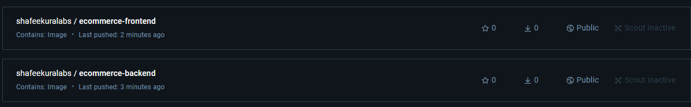
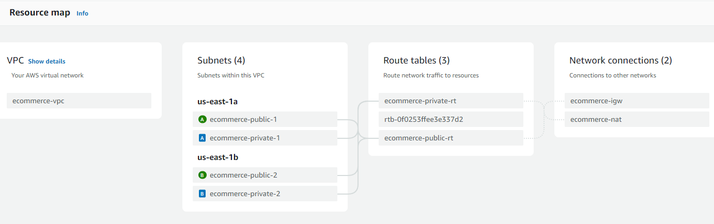
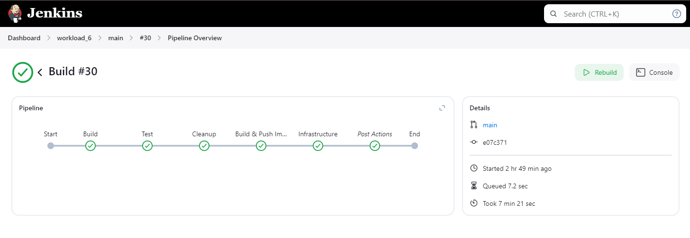
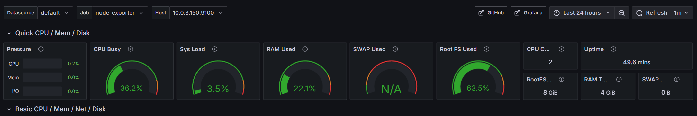
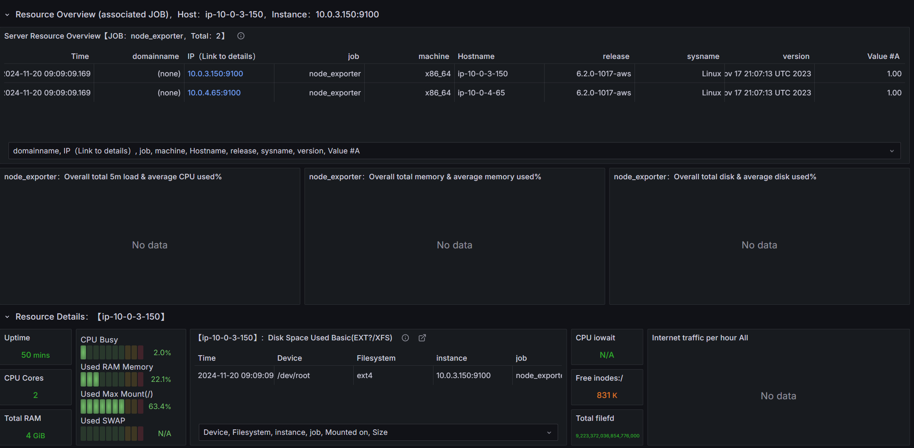
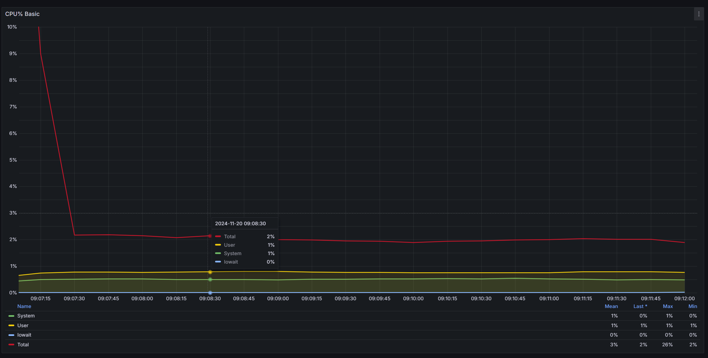
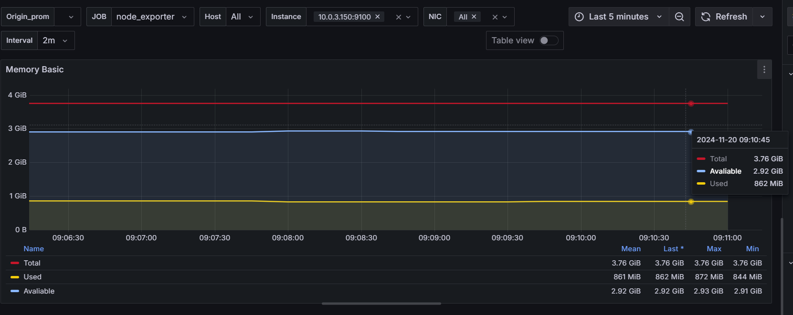

# Kura Labs Deployment 6: Containerized E-commerce Application

## Purpose

This deployment workload shows the implementation of a containerized e-commerce application using Docker, with infrastructure managed through Terraform and a CICD pipeline automated by Jenkins.

The primary goal is to showcase how containerization can simplify deployment processes and improve infrastructure management compared to traditional deployment methods.

Key objectives include:

- Implementing containerization for both frontend and backend services
- Setting up a robust CI/CD pipeline with Jenkins
- Creating a highly available infrastructure across multiple availability zones
- Establishing secure networking with bastion hosts and private subnets
- Implementing monitoring capabilities for infrastructure health
- Automating deployment processes using Docker Compose

## Architecture Overview

The infrastructure consists of:

- Custom VPC in `us-east-1` with public and private subnets across two availability zones
- Application Load Balancer directing traffic to containerized applications
- Bastion hosts in public subnets for secure access to private resources
- Application servers in private subnets running containerized services
- RDS PostgreSQL database in private subnet
- Jenkins manager and agent instances for CICD pipeline execution
- Monitoring instance for infrastructure health tracking

## Implementation Steps

1.  **Initial Setup and Configuration**

    - Created two EC2 instances:
      - Jenkins Manager (t3.micro) with Jenkins and Java 17
      - Docker_Terraform (t3.medium) with Java 17, Docker, Terraform, and AWS CLI
    - Configured Jenkins node agent for distributed pipeline execution
    - Set up necessary security groups and networking components

2.  **Docker Configuration**

    - Created Dockerfile.frontend for React application
    - Created Dockerfile.backend for Django application
    - Implemented multi-stage builds for optimization
    - Set up Docker Compose for local testing and production deployment

     

3.  **Infrastructure as Code**

    - Developed modular Terraform configuration:
      - Network module for VPC and subnet management
      - Compute module for EC2 and load balancer resources
      - Database module for RDS configuration
    - Implemented state management with local backend
    - Created reusable and maintainable infrastructure code

         

4.  **CICD Pipeline Implementation**

    - Configured Jenkinsfile with multiple stages:
      - Build: Setting up Python virtual environment
      - Test: Running Django tests
      - Cleanup: Managing Docker system and Git repository
      - Build & Push Images: Creating and pushing Docker images
      - Infrastructure: Managing Terraform state and deployment

    

5.  **Deployment Automation**

    - Created a deployment script to handle user data for EC2 creation. Included:
      - Docker installation and configuration
      - DockerHub authentication
      - Application deployment via Docker Compose
      - Node Exporter setup for monitoring

6.  **Monitoring Setup**

    - Implemented Node Exporter for metrics collection
    - Configured security groups for monitoring traffic
    - Set up systemd services for automatic startup

    ## Monitoring Previews

    #### Monitor app servers

    
    

    #### Monitor CPU

    

    #### Monitor memory

    

## Accessing Website via ALB

## Issues and Troubleshooting

1. **Database Migration Issues**

   - Problem: 502 Gateway errors due to broken migration chains
   - Solution: Implemented proper migration ordering in Dockerfile.backend and `backend-init.sh`

2. **Load Balancer Registration**

   - Problem: Initial 502 errors during deployment
   - Solution: Added health check configurations and appropriate startup delays

3. **AWS Authentication**

   - Problem: Terraform failures due to AWS CLI misconfiguration
   - Solution: Properly configured AWS credentials and validated with `aws sts get-caller-identity`

4. **Jenkins Node Connection**

   - Problem: SSH authentication failures
   - Solution: Corrected private key formatting and permissions

5. **Infrastructure Dependencies**
   - Problem: Failed Terraform applies due to incorrect resource references
   - Solution: Implemented proper dependency chains using depends_on blocks

## Optimization & Future

1. **Infrastructure Improvements**

   - Implement auto-scaling groups for application servers
   - Add CloudWatch alarms for resource monitoring
   - Implement AWS Secrets Manager for sensitive data
   - Migrate to Amazon EKS for improved container orchestration

2. **Container Optimization**

   - Implement container image scanning
   - Optimize Docker layers for faster builds
   - Add container resource limits

3. **Container Orchestration Enhancement**

   - Migrate from Docker Compose to Kubernetes
   - Implement EKS for production-grade container orchestration:
     - Better resource utilization through pod scheduling
     - Automated container health management
     - Built-in service discovery and load balancing
     - Rolling updates and rollbacks
   - Set up Kubernetes cluster autoscaling
   - Implement Kubernetes namespaces for environment isolation
   - Deploy Kubernetes operators for automated database management

4. **CICD Enhancements**

   - Implement parallel testing stages
   - Add automated rollback capabilities
   - Implement blue-green deployment strategy

5. **Security Enhancements**
   - Implement AWS WAF for the load balancer
   - Add VPC Flow Logs for network monitoring
   - Implement AWS Shield for DDoS protection

## Conclusion

This deployment workload successfully demonstrates the power of containerization in simplifying application deployment and management. By combining Docker, Terraform, and Jenkins, we've created a robust, scalable, and maintainable infrastructure that can be easily replicated and modified.

The implementation showcases several key benefits:

- Simplified deployment process through containerization
- Improved resource utilization
- Enhanced security through proper network segregation
- Automated infrastructure management
- Robust monitoring capabilities

The experience gained from this workload provides valuable insights into modern DevOps practices and the importance of proper infrastructure automation.
